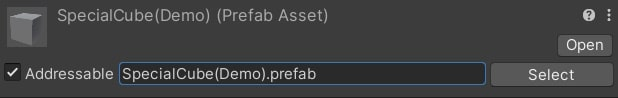

## How to Test

1. Turn these into Addressable
   ```
   ./AddressablePrefabs/SpecialCube(Demo).prefab
   ./AddressablePrefabs/RedImage(Demo).prefab
   ./AddressablePrefabs/Text1(Demo).prefab
   ./AddressablePrefabs/Text2(Demo).prefab
   ./AddressablePrefabs/Text3(Demo).prefab
   ./AddressablePrefabs/Text4(Demo).prefab
   ```
2. Give them a `Resource name` like this  
      
   The name must be these:  
   ```
   SpecialCube(Demo).prefab
   Text1(Demo).prefab
   Text2(Demo).prefab
   Text3(Demo).prefab
   Text4(Demo).prefab
   ```
   

## About the addressableKey 

In the Addressable system, the addressableKey can take various forms:

- **Resource name**: If you have a prefab called "MyCharacter," you can directly use "MyCharacter" as the key.
- **Path**: If the resource is stored under a specific path, such as "Assets/Prefabs/MyCharacter.prefab," this path can also be used as the key.
- **Tag**: If you have tagged the resource, for example, "Character," you can load all resources with this tag.
- **GUID**: Each Unity resource has a unique GUID, which can also be used as the key, although this is not the most common usage.